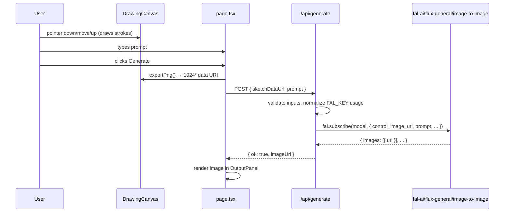

# feat: Drawing tool v1 — canvas + FAL.ai sketch-to-image generation

## Overview

Build the v1 drawing surface: a minimal pen-on-canvas UI that lets the user sketch, enter a text prompt, click **Generate**, and receive an AI-interpreted image from FAL.ai. Desktop-only, localhost demo target. Runs on the existing Next.js 16 App Router scaffold; no existing patterns to follow in this greenfield repo.

## Problem Frame

The app's stated purpose (see `docs/brainstorms/drawing-tool-requirements.md` and `CLAUDE.md`) is a draw-to-image experience. v1 delivers the synchronous version of that loop (draw → button → generate) so the FAL integration and canvas quality can be proven before any streaming / real-time work. Everything in this plan is scoped to that v1 goal.

## Requirements Trace

All requirements are inherited from the origin document. See `docs/brainstorms/drawing-tool-requirements.md` for full context and rationale.

**Drawing experience (R1–R4)**
- **R1** Single fixed-black pen tool — no shapes, no eraser, no color picker
- **R2** Brush-size control (resolved during planning: 3 fixed presets — Small / Medium / Large)
- **R3** Clear-canvas button
- **R4** Smooth stroke rendering (via `perfect-freehand`)

**Generation loop (R5–R9)**
- **R5** On-demand generation via explicit Generate button (no auto-fire, no streaming)
- **R6** Text-prompt input alongside canvas; prompt + PNG both sent to FAL
- **R7** Generated image displays in the output panel (resolved: prior image stays visible with loading overlay during a second generation)
- **R8** Loading state on Generate button while request in flight; button disabled during flight and when the canvas has zero committed strokes (`strokes.length === 0`)
- **R9** Inline error display in the output panel — all FAL failures are normalized to a single generic user-facing message (e.g., "Generation failed — please try again"); raw FAL response bodies, stack traces, and request IDs are never exposed to the client

**Layout & platform (R10–R11)**
- **R10** Side-by-side layout: canvas left, AI output right, prompt + Generate below
- **R11** Desktop-only; mouse/trackpad via Pointer Events; no touch/stylus/mobile work

Resolved during planning (carried from origin's Deferred to Planning):
- **Brush size shape:** 3 presets — Small (4), Medium (8), Large (16) — smaller implementation footprint than a slider, better discoverability than a single fixed size.
- **Post-generation drawing behavior:** prior AI image stays visible with a dim overlay + spinner during the next generation. Industry-standard; zero cost delta.
- **Undo/redo in v1:** single-level undo via **Ctrl/Cmd+Z** — removes the last committed stroke. No redo, no visible button, no history stack UI. Cheap given strokes are already stored as discrete objects for PNG export.

## Scope Boundaries

Carried from the origin document — this plan does not expand scope:

- No layers, eraser, color picker, shapes, or fill
- No public deployment infrastructure (no Upstash rate limiting, no Vercel deployment hardening — see Key Technical Decisions for the deployment assumption)
- No persistence — refresh = blank canvas, no history, no save
- No streaming / continuous generation
- No authentication, no multi-user
- No touch, stylus, or mobile viewport work
- No test framework setup required; test scenarios below are optional coverage the implementer may write or verify manually. The scaffold has no test runner configured and this plan does not add one.

## Context & Research

### Relevant Code and Patterns

This is a greenfield scaffold. No existing patterns to follow. Constraining files:

- `src/app/layout.tsx` — root layout with Geist fonts; title/description still say "Create Next App" (update in Unit 4)
- `src/app/page.tsx` — boilerplate landing page, replaced entirely in Unit 4
- `src/app/globals.css` — Tailwind v4 `@import "tailwindcss";` + `@theme inline`. Contains a boilerplate `body { font-family: Arial, ... }` that overrides the Geist theme var — fix in Unit 4
- `next.config.ts` — empty; no config needed for v1 (default body-size limit of 10MB is ample for ≤200KB base64 sketches)
- `tsconfig.json` — strict on; `@/*` → `src/*`; `lib` includes `dom` (canvas-friendly)
- `.gitignore` line 34 excludes `.env*` globally — so `.env.example` needs an explicit `!.env.example` negation to be committable (Unit 1)
- `CLAUDE.md` — already documents the FAL server-proxy pattern, FAL_KEY handling, and the on-demand v1 loop. No edits needed beyond (optional) recording the model ID choice once confirmed

No `docs/solutions/` directory exists — no institutional learnings apply.

### External References

- FAL.ai — [fal-ai/flux-general/image-to-image](https://fal.ai/models/fal-ai/flux-general/image-to-image/api) (primary endpoint with ControlNet support)
- FAL.ai — [Next.js integration docs](https://docs.fal.ai/model-apis/integrations/nextjs)
- FAL.ai — [Server-side integration](https://docs.fal.ai/model-endpoints/server-side/)
- `@fal-ai/client` on [npm](https://www.npmjs.com/package/@fal-ai/client) (v1.9.5 at plan time)
- `perfect-freehand` on [GitHub](https://github.com/steveruizok/perfect-freehand) (v1.2.x)
- Next.js 16 — [Route Handlers](https://nextjs.org/docs/app/building-your-application/routing/route-handlers), [`maxDuration`](https://vercel.com/docs/functions/configuring-functions/duration)
- perfect-freehand — [SVG vs Canvas DPI discussion](https://github.com/steveruizok/perfect-freehand/discussions/24) (informed the SVG-for-display decision)

## Key Technical Decisions

- **FAL model: `fal-ai/flux-general/image-to-image` with a canny ControlNet.** The origin deferred endpoint selection to planning. External research during planning (see Context & Research) confirmed ControlNet is more effective than plain img2img for sparse black-on-white line art, because img2img treats sparse input as noise and drifts to the prompt. Canny is the default here, but **the exact `controlnets[]` input shape and whether canny preprocessing runs server-side or expects a pre-computed edge map must be verified against the FAL playground before implementation starts** — see Open Questions → Deferred to Implementation. A concrete starting `conditioning_scale` of 0.8 is a placeholder; tune in the 0.7–0.9 range after first end-to-end call.
- **SDK: `@fal-ai/client`, not `@fal-ai/server-proxy`.** We need a bespoke Route Handler for input validation, normalized error shaping, and future-proofing (rate limiting when this eventually deploys). The `server-proxy` helper is simpler but bypasses the error-normalization requirement in R9.
- **Route Handler over Server Action.** Cleaner for attaching rate limiting later, simpler for image blob bodies (Server Actions encode args via an RSC payload, awkward for larger payloads), and works the same way if a mobile client or webhook ever calls it.
- **Node runtime, `maxDuration = 60`.** Node runtime gives full Buffer/stream support and no Edge response cap surprises. `maxDuration = 60` is a **deploy-readiness hint** for Vercel — `next dev` does not enforce it, so on localhost the Route Handler will run as long as FAL takes. For real client-side timeout protection (a stuck FAL call hanging the Generate button), the page's `fetch` must wrap the call in an `AbortController` — specified in Unit 4.
- **Input transport: base64 PNG data URI in a JSON body.** A 1024² black-line-art PNG is 50–200KB base64 — well under the 4.5MB Vercel platform cap (not relevant for localhost, but keeps the shape deploy-ready). Simpler than a two-step `fal.storage.upload` pattern for v1.
- **Display render: SVG `<path>` per committed stroke. PNG export: offscreen canvas at fixed 1024×1024 — using the SAME SVG path string as the display.** SVG gives crisp strokes at any display DPR with no manual `devicePixelRatio` math. To prevent display-vs-export geometric divergence (a real risk when SVG uses bezier curves via `getSvgPathFromStroke` but Canvas uses polygonal `lineTo` from the raw outline points), the offscreen export constructs `new Path2D(sameSvgPathString)` and fills it — identical geometry in both pipelines. Coordinates AND `size` option are both scaled by `1024 / svgCssWidth` during export so stroke thickness is preserved in the PNG at display-equivalent visual weight.
- **Stroke options: `simulatePressure: false`, `thinning: 0`.** `perfect-freehand`'s `simulatePressure: true` default fabricates pressure from velocity when mouse events report uniform `pressure: 0.5` — which produces inconsistent stroke widths that don't match the "fixed brush size" promise (R2). Explicitly disabling this ensures Size S / M / L produce consistent uniform strokes matching the user's selection. Other options (`smoothing`, `streamline`) remain tunable in implementation.
- **Stroke storage: `Stroke[]` state, committed on `pointerup`.** Each `Stroke` holds its raw input points, size, and color. In-progress stroke lives in a separate ref/state so the committed array only mutates at stroke boundaries (cheap React 19 reconciliation). Enables cheap undo via `setStrokes(s => s.slice(0, -1))`.
- **Localhost-only v1 — no rate limiting, no public-deploy hardening.** User confirmed localhost demo only. Skipping Upstash setup, body-size clamping at the Route Handler, and the NEXT_PUBLIC lint rule for v1. Normalized errors and the `process.env.FAL_KEY`-only-on-server invariant still apply — those are baseline hygiene, not deploy-specific.
- **No test framework.** Scaffold has no test runner. Test scenarios in this plan are behavior specifications the implementer can cover with ad-hoc verification or defer. If Vitest is later added, these scenarios map cleanly onto component + Route Handler tests.

## Open Questions

### Resolved During Planning

- **Primary FAL endpoint?** `fal-ai/flux-general/image-to-image` with canny ControlNet. Resolved via external research + reviewer consensus.
- **SDK choice?** `@fal-ai/client`, not `@fal-ai/server-proxy`. Driven by R9 error-normalization requirement.
- **Route Handler vs. Server Action?** Route Handler. See Key Technical Decisions.
- **Canvas render path?** SVG for display, offscreen canvas for PNG export.
- **Brush size shape?** 3 presets — Small (4), Medium (8), Large (16).
- **Undo?** Single-level Ctrl/Cmd+Z. User-resolved during planning.
- **Post-generation drawing behavior?** Prior image stays visible with loading overlay during the next generation.

### Deferred to Implementation

- **Exact `conditioning_scale` value for ControlNet.** Starting point is 0.8; tune during implementation after the first end-to-end FAL call. The range 0.7–0.9 is the research-recommended envelope — anything inside that range is acceptable.
- **Exact stroke options for `perfect-freehand`** (`thinning`, `smoothing`, `streamline`, `simulatePressure` defaults). Pick during implementation; defaults from the library README are a reasonable starting point.
- **Exact Tailwind spacing and color values for the empty-state and error-state output panel.** Low-stakes visual polish; implementer picks.

## High-Level Technical Design

> *This illustrates the intended approach and is directional guidance for review, not implementation specification. The implementing agent should treat it as context, not code to reproduce.*

### Page structure

```
src/app/page.tsx  (client component — it owns generation state)
├─ <DrawingCanvas />          (client — owns strokes, brush, undo, exportPng)
├─ <OutputPanel />            (display AI image, loading overlay, error)
├─ <PromptInput />            (controlled text field)
└─ <GenerateButton />         (disabled | idle | loading states)
```

### Generation flow (happy path)



### Error normalization contract

The Route Handler always returns one of two JSON shapes to the client, regardless of what FAL returns or how the call fails:

```
Success:  { ok: true,  imageUrl: string }
Failure:  { ok: false, error: string /* short human-readable */ }
```

Raw FAL error bodies, stack traces, and request IDs are never forwarded to the client — they are `console.error`'d server-side. This satisfies R9 and the security-lens finding about error passthrough.

### Data shapes

```ts
// Stroke storage (DrawingCanvas state)
type StrokePoint = [x: number, y: number, pressure: number];
type Stroke = { points: StrokePoint[]; size: number; color: "#000000" };

// Route Handler contract (request/response)
type GenerateRequest  = { sketchDataUrl: string; prompt: string };
type GenerateResponse = { ok: true; imageUrl: string } | { ok: false; error: string };
```

## Implementation Units

- [ ] **Unit 1: Install dependencies and environment scaffolding**

**Goal:** Install `@fal-ai/client` and `perfect-freehand`. Set up the `.env.local` + `.env.example` pattern. Ensure the implementer can acquire a FAL key and run the dev server with it.

**Requirements:** *(enables R5, R6 — no behavioral requirement directly)*

**Dependencies:** None.

**Files:**
- Modify: `package.json` (adds `@fal-ai/client`, `perfect-freehand` to dependencies)
- Modify: `package-lock.json`
- Create: `.env.example` (has `FAL_KEY=` placeholder + one-line comment)
- Create: `.env.local` (local, gitignored, placeholder only — implementer fills in real key)
- Modify: `.gitignore` (add `!.env.example` negation so the example file can be committed)
- Modify: `README.md` (add a short "Getting started" section: clone → `npm install` → copy `.env.example` to `.env.local` → fill in FAL_KEY → `npm run dev`)

**Approach:**
- Install packages via `npm install @fal-ai/client perfect-freehand`
- Do not commit `.env.local` — verify by checking `git status` shows it untracked after `.gitignore` update
- README section should be short — getting-started, not a full docs page

**Patterns to follow:** None (greenfield).

**Test scenarios:** *Test expectation: none — pure configuration and dependency management. Verification is in the next unit (Route Handler can actually reach FAL with the key in `.env.local`).*

**Verification:**
- `npm run dev` starts without errors
- `process.env.FAL_KEY` is reachable from server code (proven in Unit 2)
- `.env.local` appears in `git status` as ignored; `.env.example` appears as tracked

---

- [ ] **Unit 2: FAL generate Route Handler with normalized error responses**

**Goal:** Build the server-side `/api/generate` Route Handler that accepts `{ sketchDataUrl, prompt }`, validates input, calls FAL with a canny ControlNet, and returns a normalized JSON response. Never leaks the FAL key or raw FAL errors to the client.

**Requirements:** R5, R6, R9.

**Dependencies:** Unit 1.

**Files:**
- Create: `src/app/api/generate/route.ts` — POST handler, Node runtime, `maxDuration = 60`
- Create: `src/lib/fal.ts` — thin module that exports the model ID constant, default `conditioning_scale`, and a configured `fal` instance (calls `fal.config({ credentials: process.env.FAL_KEY })` once at module scope)

**Approach:**
- Top of `route.ts`: `export const runtime = 'nodejs'` and `export const maxDuration = 60`
- POST handler:
  1. Parse `await req.json()` into `{ sketchDataUrl, prompt }` with simple shape validation (strings, prompt ≤ 500 chars, sketchDataUrl starts with `data:image/png;base64,`)
  2. On validation failure: return `{ ok: false, error: "Invalid request" }` with 400
  3. Call `fal.subscribe(MODEL_ID, { input: { prompt, control_image_url: sketchDataUrl, controlnets: [{ path: "canny", ... }], conditioning_scale: 0.8 } })` — exact input shape per [FAL `flux-general/image-to-image` API](https://fal.ai/models/fal-ai/flux-general/image-to-image/api)
  4. On success: return `{ ok: true, imageUrl: result.data.images[0].url }` with 200
  5. On FAL error or exception: `console.error(err)` server-side; return `{ ok: false, error: "Generation failed — please try again" }` with 502. No raw FAL response, no stack trace, no request ID in the response body.
- `src/lib/fal.ts` keeps the model ID as a single constant (swappable for the FAL playground testing phase; reviewer concern about hard-coded model ID)
- Hard invariant: `process.env.FAL_KEY` is referenced only in `src/lib/fal.ts`, never in client code. Do not define `NEXT_PUBLIC_FAL_KEY`, ever.

**Patterns to follow:** None (no existing Route Handlers in the repo).

**Test scenarios:**
- Happy path: POST with valid `sketchDataUrl` + prompt → 200, `{ ok: true, imageUrl: <url> }`
- Happy path: POST with empty prompt (sketch alone) → still 200 (empty prompt is allowed; sketch + ControlNet is valid FAL input)
- Edge case: Missing `sketchDataUrl` → 400, `{ ok: false, error: "Invalid request" }`
- Edge case: `prompt` longer than 500 chars → 400, `{ ok: false, error: "..." }`
- Edge case: `sketchDataUrl` not a `data:image/png;base64,` prefix → 400
- Error path: FAL returns HTTP 500 → handler returns 502 with generic error message; raw FAL body is NOT in response
- Error path: FAL times out → handler returns 504 or 502 with generic message; no stack trace in response
- Security: search response body in all error branches — assert no string contains the `FAL_KEY` value, no substring looks like a stack trace, no `requestId` from FAL is forwarded

**Verification:**
- A manual curl to `http://localhost:3000/api/generate` with a small test PNG data URI returns a valid imageUrl
- Inducing an error (e.g., bogus model ID) returns the normalized error shape, not a raw FAL response
- No `NEXT_PUBLIC_FAL_*` env var exists anywhere in the repo

---

- [ ] **Unit 3: Drawing canvas component**

**Goal:** Build `<DrawingCanvas />` — a `'use client'` component that renders an SVG-based drawing surface with pen input, 3 brush sizes, clear, single-level Ctrl/Cmd+Z undo, and an imperative `exportPng()` method that returns a 1024² PNG data URI for FAL.

**Requirements:** R1, R2, R3, R4 (and enables R5's generation flow by exposing `exportPng`).

**Dependencies:** Unit 1.

**Files:**
- Create: `src/components/DrawingCanvas.tsx` — the component
- Create: `src/components/DrawingCanvas.types.ts` — `Stroke`, `StrokePoint` exported types (optional split; may inline in the component file if trivial)

**Approach:**
- Top of file: `'use client'`
- State:
  - `strokes: Stroke[]` — committed strokes, seeds display and PNG export
  - `inProgress: Stroke | null` — current stroke being drawn (kept out of the committed array for clean React reconciliation)
  - `brushSize: 4 | 8 | 16` — controlled by 3 size-preset buttons
- Render:
  - A fixed-size `<svg>` element (e.g., 512×512 CSS px — the canvas the user draws on; see HiDPI note below)
  - One `<path fill="#000000" d={getSvgPathFromStroke(getStroke(stroke.points, options))} />` per committed stroke, plus one for the in-progress stroke
  - A `getSvgPathFromStroke` helper copied from the perfect-freehand README (not exported from the package) — converts stroke outline points to an SVG `d` string
- Pointer handling via Pointer Events on the SVG:
  - `onPointerDown` → begin in-progress stroke with `{ points: [[x, y, e.pressure]], size: brushSize, color: "#000000" }`, capture pointer via `e.currentTarget.setPointerCapture(e.pointerId)`
  - `onPointerMove` → append point to in-progress stroke (only if captured)
  - `onPointerUp` → commit in-progress to `strokes`, clear in-progress
  - Pointer leaving the SVG element does NOT end the stroke — `setPointerCapture` handles this correctly
- Brush size UI: three small buttons labeled S / M / L below the canvas
- Clear button: sets both `strokes` and `inProgress` to empty
- Undo: `useEffect` mounts a `keydown` listener on `window`; if `(e.metaKey || e.ctrlKey) && e.key.toLowerCase() === 'z'`, call `setStrokes(s => s.slice(0, -1))`. Single-level only — no redo, no history stack.
- `exportPng(): string` — imperative method exposed via `useImperativeHandle` on a forwardRef:
  - Creates an offscreen `HTMLCanvasElement` at fixed 1024×1024 (regardless of the SVG's display size)
  - Fills with opaque white background (`fillRect` with `#FFFFFF` — prevents the transparent-PNG img2img footgun)
  - For each stroke: compute outline via `getStroke`, build a `Path2D` from the outline points, `ctx.fillStyle = stroke.color`, `ctx.fill(path)` — scaled by 1024/svgCssWidth so coordinates map correctly
  - Returns `offscreen.toDataURL('image/png')`

**Patterns to follow:** None. External reference: [perfect-freehand README rendering example](https://github.com/steveruizok/perfect-freehand) for `getSvgPathFromStroke`.

**Test scenarios:**
- Happy path: simulate pointer down → 3 pointer moves → pointer up → component has 1 committed stroke
- Happy path: change brush size to Large before drawing → new stroke has `size: 16`
- Happy path: Clear button sets `strokes` to empty; SVG has zero `<path>` elements
- Edge case: Ctrl+Z removes the most recent stroke; remaining strokes unchanged
- Edge case: Cmd+Z (on macOS) also removes the last stroke — check `metaKey || ctrlKey`
- Edge case: Ctrl+Z with zero strokes is a no-op (no crash, no negative-length array)
- Edge case: `exportPng()` on an empty canvas returns a data URI of a 1024×1024 white PNG (no strokes drawn)
- Edge case: `exportPng()` always returns 1024×1024 PNG regardless of display SVG size — verify by decoding the data URI header
- Edge case: User starts drawing, drags pointer outside the SVG, drags back, releases → one continuous committed stroke (pointerCapture keeps the stream live)
- Edge case: Component unmounts mid-stroke → the `window` keydown listener is removed (no memory leak or duplicate listener after remount)
- Edge case: React 19 StrictMode dev double-invocation — the canvas init effect's cleanup runs then the effect re-runs, with no duplicate listeners or lost state

**Verification:**
- Manual: open the page, draw a few strokes, check visual smoothness vs. jagged polylines
- Manual: Ctrl+Z removes the last stroke visually
- Manual: click Clear — canvas is empty
- Manual: hook up a debug button that calls `exportPng()` and logs the first 60 chars of the data URI (should start with `data:image/png;base64,iVBOR...`)

---

- [ ] **Unit 4: Main page layout + generation flow wiring**

**Goal:** Replace the scaffold landing page with the two-panel drawing-app UI. Wire the Generate button to the Route Handler, manage loading / error / stale-image states in the output panel, and fix the leftover boilerplate in `layout.tsx` and `globals.css`.

**Requirements:** R5, R6, R7, R8, R9, R10 (R11 is a platform constraint already handled by Pointer Events in Unit 3).

**Dependencies:** Units 1, 2, 3.

**Files:**
- Modify: `src/app/page.tsx` — replaces the scaffold entirely; becomes a `'use client'` component owning generation state
- Modify: `src/app/layout.tsx` — update `metadata.title` from "Create Next App" to something project-appropriate ("Drawing tool" or similar); update description
- Modify: `src/app/globals.css` — remove the boilerplate `body { font-family: Arial, Helvetica, sans-serif; }` override (pre-existing bug; the Geist theme var should win)

**Approach:**
- `page.tsx`:
  - `'use client'` at top
  - Owns state:
    - `prompt: string` — controlled text input
    - `canvasRef` — ref to `<DrawingCanvas />` for calling `exportPng()`
    - `status: 'idle' | 'loading' | 'error'`
    - `imageUrl: string | null` — last successful generation (null until first success)
    - `errorMessage: string | null`
    - `hasStrokes: boolean` — derived from the canvas ref or lifted from the child via callback
  - Layout (Tailwind v4): top-level flex row, two panels side-by-side, each `flex-1`. Below the panels: a row with the prompt input and Generate button. Inline brush size presets + Clear button live inside the canvas panel. Min-width assumption: ~1024px viewport; no responsive breakpoints in v1.
  - Generate handler:
    1. Read `sketchDataUrl = canvasRef.current.exportPng()`
    2. Set `status = 'loading'`
    3. `fetch('/api/generate', { method: 'POST', body: JSON.stringify({ sketchDataUrl, prompt }), headers: { 'Content-Type': 'application/json' } })`
    4. On `{ ok: true, imageUrl }`: set `imageUrl`, `status = 'idle'`
    5. On `{ ok: false, error }`: set `errorMessage = error`, `status = 'error'`
    6. On network throw: set `errorMessage = "Network error — check your connection and try again"`, `status = 'error'`
  - Output panel states:
    - Empty (initial, no imageUrl): show muted placeholder text (e.g., "Your generation will appear here")
    - Loading-first (status loading, imageUrl null): centered spinner
    - Loading-subsequent (status loading, imageUrl present): show the old image dimmed with a spinner overlay — implements R7's resolved deferred question
    - Success (status idle, imageUrl present): show the image
    - Error (status error): show errorMessage inline; Generate button re-enables
  - Generate button states:
    - Disabled when `hasStrokes === false` (empty canvas)
    - Disabled when `status === 'loading'` (prevents double-fire; also guards rapid-click case)
    - Label "Generate" in idle, "Generating…" with a spinner when loading
- `layout.tsx`: minor metadata replacement only
- `globals.css`: delete the Arial override rule

**Patterns to follow:** None.

**Test scenarios:**
- Happy path: draw strokes → type prompt "a dragon" → click Generate → output image appears in the right panel
- Happy path: Generate with empty prompt (sketch only) → still works (R6 confirmed empty prompt is valid)
- Edge case: Generate button is disabled when canvas has zero strokes
- Edge case: button shows "Generating…" + spinner during fetch; disabled throughout
- Edge case: second Generate call while a prior image is visible → old image stays visible with dim overlay + spinner until new one arrives (R7 resolved)
- Edge case: rapid double-click on Generate → the second click is absorbed by the disabled button; exactly one POST fires
- Error path: Route Handler returns `{ ok: false, error: "..." }` → error message appears in output panel; Generate button re-enables; user can try again without refresh
- Error path: network error (e.g., dev server down) → generic network error message in output panel
- Integration: the full flow from draw → click → fetch → render hits the real Route Handler in `npm run dev` (not just mocked)

**Verification:**
- `npm run dev` → open `http://localhost:3000` → full draw-to-generate loop works end-to-end with a real FAL call
- Generated image actually reflects the sketch composition (success criterion from origin) — if the generated image looks like "dragon-from-prompt-alone-ignoring-sketch", the ControlNet conditioning_scale needs tuning (Deferred-to-Implementation question)
- `layout.tsx` metadata no longer says "Create Next App"
- The Geist font shows in the body text (Arial override removed)

## System-Wide Impact

- **Interaction graph:** The Route Handler is the only server-side code. No middleware, no callbacks, no cross-cutting interceptors. A future deployment phase would add Upstash middleware keyed by IP.
- **Error propagation:** Errors flow `FAL throw → Route Handler catch → normalized JSON → page.tsx state → OutputPanel inline message`. Raw errors are `console.error`'d server-side only.
- **State lifecycle:** Page owns generation state. DrawingCanvas owns stroke state. No global state; no cache; no persistence — a page refresh loses everything, which is explicitly in scope.
- **Unchanged invariants:** No existing API surfaces, no downstream consumers, no framework contracts this plan modifies. The Next.js 16 App Router scaffold's bundling, metadata, and routing conventions are preserved.

## Risks & Dependencies

| Risk | Mitigation |
|---|---|
| FAL `conditioning_scale: 0.8` default produces output that ignores the sketch (or is over-constrained) | Deferred to implementation; tune in the 0.7–0.9 range after first end-to-end call. Verification step in Unit 4 explicitly checks sketch composition is reflected. |
| `fal-ai/flux-general/image-to-image` model is renamed or deprecated in the FAL catalog between this plan and implementation | Model ID lives as a single constant in `src/lib/fal.ts` — swap in one place. If the endpoint is gone, check [fal.ai/models](https://fal.ai/models) for the current flux + ControlNet endpoint. |
| `perfect-freehand` default options produce strokes that look off — too thick, too thin, too wiggly | Low-stakes polish; tune stroke options during implementation. Defaults from the README are a reasonable starting point. |
| `exportPng()` renders at 1024² but the display SVG is 512² — coordinate scaling is a common off-by-one / coordinate-system bug | Explicit scale factor `1024 / svgCssWidth` applied to all stroke coordinates in the offscreen render. Verification step checks the generated PNG renders the same shape visually (not flipped, not clipped). |
| FAL_KEY accidentally prefixed `NEXT_PUBLIC_FAL_KEY` during a quick debug attempt, bundling it into client JS | Key is referenced only in `src/lib/fal.ts` (server-only code); a grep before each commit would catch `NEXT_PUBLIC_FAL_*`. Documented in CLAUDE.md. Localhost-only deployment reduces urgency but not correctness. |
| Users may assume the 15s success criterion from the origin document applies — but ControlNet pipelines typically run 4–12s, and FLUX can hit 12–18s cold | Not blocking for v1 (localhost). `maxDuration = 60` accommodates worst case. Revisit if the round-trip feels too slow during demo. |

## Sources & References

- **Origin document:** [docs/brainstorms/drawing-tool-requirements.md](../brainstorms/drawing-tool-requirements.md)
- Project context: [CLAUDE.md](../../CLAUDE.md)
- FAL.ai API: [fal-ai/flux-general/image-to-image](https://fal.ai/models/fal-ai/flux-general/image-to-image/api)
- FAL.ai Next.js integration: https://docs.fal.ai/model-apis/integrations/nextjs
- `@fal-ai/client`: https://www.npmjs.com/package/@fal-ai/client
- `perfect-freehand`: https://github.com/steveruizok/perfect-freehand
- Next.js 16 Route Handlers: https://nextjs.org/docs/app/building-your-application/routing/route-handlers
- Vercel Function maxDuration: https://vercel.com/docs/functions/configuring-functions/duration
