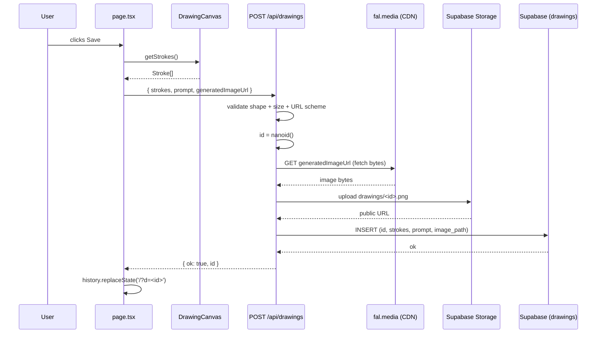
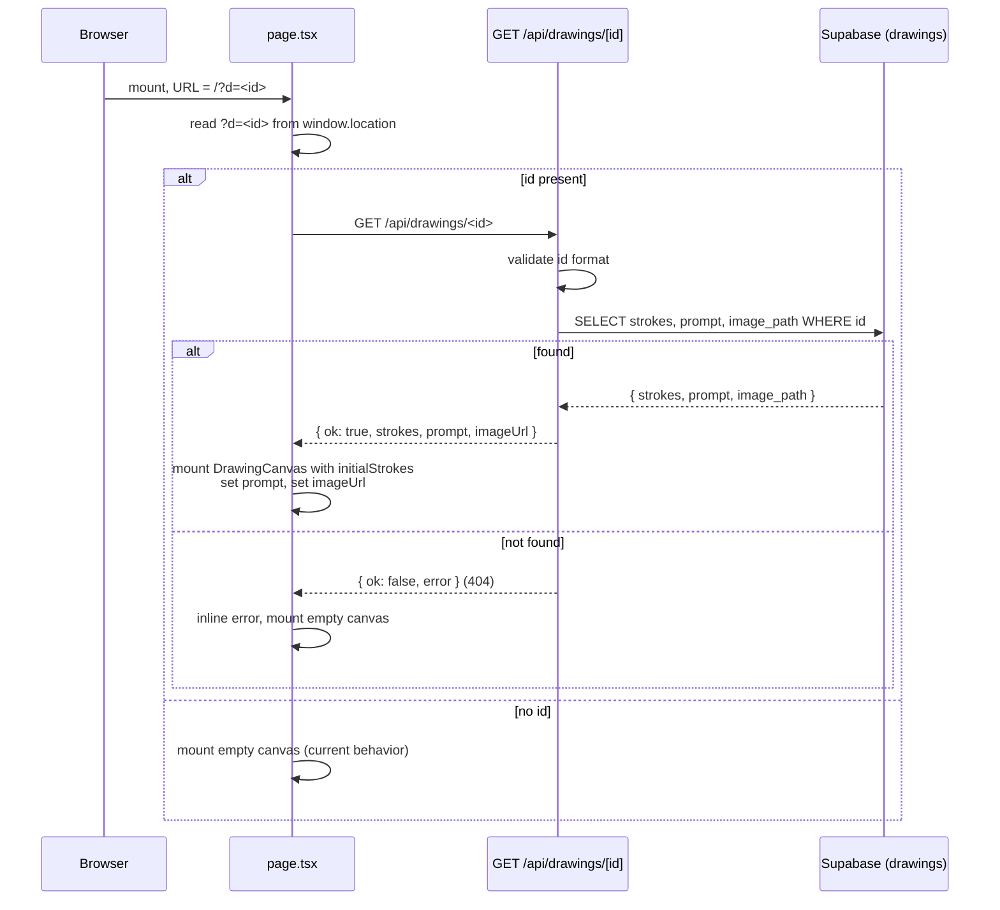

# feat: Save + load drawing-and-result pairs via Supabase (URL-addressable, no auth)

## Overview

Add persistence to the drawing app so a user can click **Save** and get a shareable URL containing an unguessable ID. A save captures a **pair** — the drawn strokes *and* the FAL-generated image that came out of them (plus the prompt that produced it, since it's tiny and tells the full story). When the app loads with that ID in the URL it fetches the stored pair and restores both panels: strokes on the canvas, generated image in the output panel. No authentication — URL possession is the access model. With no ID in the URL, the app behaves exactly as it does today: blank canvas, empty output panel.

## Problem Frame

There is no upstream requirements document — the user brief is the origin. v1 (`docs/plans/2026-04-15-001-feat-drawing-tool-v1-plan.md`) explicitly scoped out persistence. This plan adds the smallest useful persistence layer: share a complete "draw → prompt → FAL image" artifact as a single URL. The existing FAL Route Handler at `src/app/api/generate/route.ts` is the pattern this plan follows for server-side credential handling and normalized error shapes.

User explicitly clarified that a save captures the drawing **and** the generated image together as a pair — not strokes alone. That drives the "persist the FAL image in Supabase Storage" decision below: FAL-hosted URLs are not guaranteed permanent, so a share link that relies on them would rot silently.

## Requirements Trace

Derived from the user brief (no origin document):

- **R1.** A "Save" button persists the current drawing + generated image + prompt to Supabase and receives back an unguessable ID.
- **R2.** Save is only enabled when **both** strokes AND a successfully-generated image exist. "Save" captures a pair; saving half of a pair isn't a pair.
- **R3.** After a successful save, the browser URL updates to include the ID (no navigation / re-render) so the user can copy it from the address bar to share.
- **R4.** On page load, if the URL contains a drawing ID, fetch the pair and render it: strokes on the canvas, image in the output panel, prompt in the input field — before the canvas becomes interactive.
- **R5.** On page load with no ID, start with a blank canvas and empty output panel — current behavior unchanged.
- **R6.** On page load with an invalid or not-found ID, show an inline error and render a blank canvas (not a crash, not a redirect).
- **R7.** Each save creates a new immutable record with a new ID — prior URLs remain valid. "Save" is never an update.
- **R8.** The generated image is stored in Supabase Storage (not referenced via a FAL URL) so share links remain valid indefinitely.
- **R9.** Supabase credentials (service-role key) are referenced only server-side and never ship to the client bundle. Same invariant as `FAL_KEY`.

## Scope Boundaries

- No auth, no user accounts, no sign-in.
- No listing, gallery, or search of saved pairs.
- No update or delete of saved pairs (saves are immutable).
- No saving of intermediate state (brush size selection, undo history). Strokes + prompt + final image only.
- No TTL / expiration for saved records or stored images.
- No public-deployment hardening (no rate limiting, no body-size clamping at the edge, no Upstash). Matches the v1 `Scope Boundaries` posture in `CLAUDE.md`. If this ever deploys publicly, anyone with the save endpoint URL can fill the Supabase table and Storage bucket — add rate limiting first.
- No test framework setup. Test scenarios below are behavior specs the implementer can cover manually or via Vitest if added later.

## Context & Research

### Relevant Code and Patterns

- `src/app/api/generate/route.ts` — the **pattern to follow**: Node runtime, `maxDuration`, module-scope SDK config, input validation with size caps, `{ ok, ... } | { ok: false, error }` response shape, all failures normalized to a generic message with raw errors logged server-side via `console.error(err.message)`.
- `src/components/DrawingCanvas.tsx` — owns `strokes: Stroke[]` state internally. Exposes only `exportPng()` via `useImperativeHandle`. Accepts no initial strokes today. Needs two minimal additions: an `initialStrokes?: Stroke[]` prop and a `getStrokes(): Stroke[]` method on the handle. Stroke shape (`{ points: StrokePoint[]; size: number }`) is the serialization format — no translation needed.
- `src/app/page.tsx` — already a `'use client'` component owning `prompt`, `imageUrl`, and `canvasRef`. Natural home for Save button, URL-param reading, and post-save URL update.
- `next.config.ts` — `images.remotePatterns` already allows `**.fal.media` / `**.fal.ai`. After this change the `<Image>` src will often point at a Supabase Storage public URL instead — add the Supabase public-storage host to `remotePatterns` in Unit 1.
- `CLAUDE.md` — the key-handling invariant (no `NEXT_PUBLIC_*` prefix, server-only reference). Applies to Supabase creds identically.
- `.gitignore` — the `.env*` rule already covers `.env.local`; `!.env.example` negation is already in place from v1.

### Institutional Learnings

`docs/solutions/` does not exist. No institutional learnings apply.

### External References

- [`@supabase/supabase-js`](https://www.npmjs.com/package/@supabase/supabase-js) — official JS client. Service-role key on the server only.
- [`nanoid`](https://www.npmjs.com/package/nanoid) — URL-safe, collision-resistant ID generator (default 21 chars, ~126 bits entropy). Server-side.
- [Supabase service role key vs anon key](https://supabase.com/docs/guides/api/api-keys) — service role bypasses RLS; must never be exposed to the client.
- [Supabase Storage — public vs private buckets](https://supabase.com/docs/guides/storage/security/access-control) — public buckets serve objects at stable CDN URLs. Appropriate here since "knows the URL = can see the image" matches our access model exactly.
- [FAL file durability](https://docs.fal.ai/model-endpoints/server-side/) — FAL-hosted image URLs are not documented as permanent; treat them as ephemeral. Why R8 requires re-uploading to Supabase Storage.

## Key Technical Decisions

- **Server-route proxy, not direct client → Supabase.** Matches the existing FAL pattern. Keeps all DB access behind input-validated, error-normalized endpoints. Service-role key stays on the server. If we ever want client-side Supabase + RLS later, the contract between `page.tsx` and `/api/drawings` is the only thing that changes.

- **Persist the FAL image in Supabase Storage, not as a FAL URL reference.** The whole point of a share link is durability. FAL image URLs are not documented as permanent. On save, the server fetches the bytes from the FAL URL, uploads them to a Supabase Storage bucket keyed by the drawing id, and stores the Storage path in the DB. Load returns the public Storage URL, which is stable.

- **Public Storage bucket, not private + signed URLs.** The access model is "URL possession grants access" — which is exactly what a public bucket provides. Signed URLs would add expiry, regeneration flows, and a per-load signing round-trip, with no security benefit given the DB record itself is already effectively public to anyone with the id. The bucket must be **strictly scoped to this feature** (`drawings` only) so enabling public access doesn't bleed into other future buckets.

- **Immutable snapshots — every Save is an `INSERT` + upload with a new ID.** User brief says "each save gets an unguessable ID," implying snapshots rather than updates. Simpler code, no partial-write concerns, prior URLs keep working. Duplicate saves produce duplicate rows + duplicate stored images; acceptable (cost: a row + ~1MB of storage).

- **ID scheme: `nanoid()` (default 21 chars) generated server-side.** URL-safe, unguessable (~126 bits of entropy), nicer in URLs than a UUID. Same id is used for the DB row, the Storage object key, and the shareable URL param — one id, one addressable object, easy to trace in logs.

- **Storage object key: `<id>.png`** under the `drawings` bucket. One-to-one with the DB row. Simple to delete-if-we-ever-need-to-delete. PNG-only because that's what FAL returns and what our Image component renders.

- **URL shape: query parameter `?d=<id>` on `/`, not a path segment `/d/[id]`.** The app is a single page; no new route is needed. Reading the param on mount from `window.location.search` sidesteps the `useSearchParams` + Suspense dance under Next.js 16 App Router. Cheap to migrate later.

- **URL update after save: `history.replaceState`, not `router.replace`.** `router.replace` triggers a Next.js navigation and would re-run the page's mount effect, which would re-fetch the pair we just saved. `history.replaceState` updates the address bar in place with no navigation.

- **Save-enable gate: both `hasStrokes === true` AND `imageUrl !== null`.** Matches "pair" semantics per R2. A user who drew but hasn't generated, or generated but cleared, cannot save.

- **Save what's currently visible, not what was last generated.** If the user generates, then draws more strokes without re-generating, the Save button captures the *current* strokes paired with the *last-generated* image. That pair may be "inconsistent" (image doesn't match latest strokes) but it matches what the user sees on screen at the moment they click Save, which is the expectation for a share button. Alternative — force re-generate before Save — is slower and more expensive. Accept the possible mismatch; it's the user's call.

- **Strokes stored as JSONB, image as Storage object, prompt as text column.** Strokes are ~100KB JSON typically, well-suited to JSONB. Prompt is ≤ 500 chars per the FAL route's cap. Image is a binary blob — wrong for JSONB, right for Storage.

- **Enable RLS on the `drawings` table with no policies.** Server uses service role, which bypasses RLS. Enabling RLS with zero policies means any anon-key client is denied by default. Defense in depth — costs nothing, prevents a common footgun where a future contributor adds an anon-key client and accidentally exposes writes.

- **No RPC functions, no database triggers.** Straightforward `INSERT` + `SELECT`.

- **No test framework added.** Same posture as the v1 plan.

## Open Questions

### Resolved During Planning

- **What does "save" mean — strokes only, or the whole pair?** → The whole pair: strokes + prompt + generated image. (User-confirmed.)
- **How durable is the saved image link?** → Must be permanent → Supabase Storage, not FAL URL reference.
- **Public bucket or signed URLs?** → Public. Matches "URL = access" model.
- **URL shape?** → `/?d=<id>` query param.
- **ID generation site?** → Server-side `nanoid()`.
- **Immutable or mutable saves?** → Immutable.
- **Save-enable rule?** → Both strokes AND a generated image must exist.
- **Client → Supabase or server proxy?** → Server proxy, matching the FAL route.
- **RLS?** → Enabled with no policies; server uses service role.

### Deferred to Implementation

- **Exact layout of the Save button and its disabled-state messaging.** Next to Generate? Under the output panel? Low-stakes UI polish.
- **Exact copy for error states** ("Drawing not found", "Couldn't save — please try again", "Image couldn't be loaded").
- **Whether clicking Clear strips `?d=<id>` from the URL.** Defensible either way; pick during implementation.
- **Whether to show a transient "Saved ✓ — URL updated" confirmation.** Not spec'd.
- **Whether Save auto-copies the URL to the clipboard.** Nice-to-have; address-bar copy works fine as a baseline.
- **Eviction policy if the Supabase Storage bucket grows unbounded.** Not an issue for localhost demo; revisit before public deploy.

## High-Level Technical Design

> *This illustrates the intended approach and is directional guidance for review, not implementation specification. The implementing agent should treat it as context, not code to reproduce.*

### Save flow



### Load flow (page mount)



### Data shapes

```ts
// Request / response contracts
type SaveRequest  = { strokes: Stroke[]; prompt: string; generatedImageUrl: string };
type SaveResponse = { ok: true; id: string } | { ok: false; error: string };

type LoadResponse =
  | { ok: true; strokes: Stroke[]; prompt: string; imageUrl: string }
  | { ok: false; error: string };

// Supabase row
// drawings(
//   id           text primary key,
//   strokes      jsonb      not null,
//   prompt       text       not null default '',
//   image_path   text       not null,   -- e.g. "drawings/V1StGXR8….png"
//   created_at   timestamptz not null default now()
// )
```

## Implementation Units

- [ ] **Unit 1: Supabase scaffolding — client, env vars, schema, Storage bucket**

**Goal:** Install the Supabase + nanoid packages, set up env vars, add a server-only Supabase client module, commit the SQL schema, create the Storage bucket, extend `next.config.ts` image remote patterns, and document the setup in `CLAUDE.md`.

**Requirements:** R8 (Storage bucket), R9 (server-only credentials). Enables R1, R4.

**Dependencies:** None.

**Files:**
- Modify: `package.json`, `package-lock.json` (add `@supabase/supabase-js`, `nanoid`)
- Modify: `.env.example` (add `SUPABASE_URL=` and `SUPABASE_SERVICE_ROLE_KEY=` placeholders with one-line comments)
- Modify: `.env.local` (local, gitignored — implementer fills in real values)
- Create: `src/lib/supabase.ts` — configured server-side client (reads env at module scope, exports a singleton). Throws a clear error if either env var is missing so failures surface early instead of producing cryptic Supabase errors at request time.
- Create: `supabase/schema.sql` — `drawings` table + RLS + Storage bucket creation (as SQL statements paste-able into the Supabase SQL editor).
- Modify: `next.config.ts` — add the Supabase Storage public host to `images.remotePatterns` so the `<Image>` component can load saved images. Host pattern: `*.supabase.co` (matches project-specific subdomain).
- Modify: `CLAUDE.md` — add a "Supabase integration" section analogous to the existing "FAL.ai integration" section: what's stored, env var names, schema reference, server-only invariant, scope boundaries for v1, the "image durability → Storage, not FAL URL" decision.
- Modify: `README.md` if one exists (otherwise skip) — extend getting-started with Supabase setup.

**Approach:**
- `src/lib/supabase.ts` exports a configured client created with `createClient(SUPABASE_URL, SUPABASE_SERVICE_ROLE_KEY, { auth: { persistSession: false } })`. `persistSession: false` matters — the server client must never try to read/write auth tokens.
- Variable names stay un-prefixed — `SUPABASE_URL`, not `NEXT_PUBLIC_SUPABASE_URL`. Prefixing would bundle them client-side.
- Schema (paste into Supabase SQL editor):
  ```sql
  create table public.drawings (
    id          text primary key,
    strokes     jsonb not null,
    prompt      text not null default '',
    image_path  text not null,
    created_at  timestamptz not null default now()
  );
  alter table public.drawings enable row level security;
  -- No policies → anon key cannot read or write. Service role bypasses RLS.

  -- Storage bucket (public — URL possession = access, same as the DB record)
  insert into storage.buckets (id, name, public)
  values ('drawings', 'drawings', true)
  on conflict (id) do nothing;
  ```
- `next.config.ts` — the pattern for this subdomain looks like:
  ```ts
  { protocol: "https", hostname: "*.supabase.co", pathname: "/storage/v1/object/public/**" }
  ```
  Scope the `pathname` so we're not accidentally whitelisting every Supabase endpoint for image loads.
- `CLAUDE.md` section should mirror the FAL section's structure.

**Patterns to follow:** `src/app/api/generate/route.ts` uses `fal.config({ credentials: process.env.FAL_KEY })` at module scope; `src/lib/supabase.ts` mirrors that posture.

**Test scenarios:** *Test expectation: none — configuration and dependency management. Verified indirectly by Units 2 and 3 reaching Supabase and Storage.*

**Verification:**
- `npm run dev` starts without errors.
- Schema SQL runs cleanly in a fresh Supabase project.
- Storage bucket `drawings` appears as public in the Supabase dashboard.
- `git status` shows `.env.local` ignored and `.env.example` tracked.
- `grep -r "NEXT_PUBLIC_SUPABASE" src` returns nothing.
- `grep -r "SUPABASE_SERVICE_ROLE_KEY" src` returns only `src/lib/supabase.ts`.

---

- [ ] **Unit 2: `POST /api/drawings` — save route (strokes + image fetch + storage upload + DB insert)**

**Goal:** Server Route Handler that accepts `{ strokes, prompt, generatedImageUrl }`, validates everything, downloads the image bytes from the FAL URL, uploads them to Supabase Storage under `drawings/<id>.png`, and inserts a row pairing them. Returns `{ ok: true, id }`. Normalized error shapes; no raw Supabase or fetch errors in responses.

**Requirements:** R1, R2, R7, R8, R9.

**Dependencies:** Unit 1.

**Files:**
- Create: `src/app/api/drawings/route.ts` — POST handler, Node runtime, `maxDuration = 30` (image fetch + upload + insert should be well under 10s typically; 30s buffers against slow FAL CDN).

**Approach:**
- `export const runtime = "nodejs"` and `export const maxDuration = 30`.
- Validation (reject with 400 / 413 as appropriate):
  1. `strokes` is an array; stringified length ≤ `MAX_STROKES_CHARS` (500_000).
  2. Each stroke has `points: Array<[number, number, number]>` and `size: number`. Reject `points.length > 10_000` or `strokes.length > 5_000`.
  3. `prompt` is a string, length ≤ 500 (matches the FAL route's `MAX_PROMPT_CHARS`).
  4. `generatedImageUrl` is a string starting with `https://` AND its hostname ends with `.fal.media` or `.fal.ai`. **Do not skip the hostname check** — an unvalidated URL here is an SSRF vector where an attacker could ask the server to fetch arbitrary internal URLs.
- Generate `id = nanoid()`.
- Fetch the image: `const res = await fetch(generatedImageUrl); if (!res.ok) throw …; const bytes = new Uint8Array(await res.arrayBuffer())`.
- Reject if `bytes.byteLength > MAX_IMAGE_BYTES` (e.g., 10 MB — FAL PNGs are typically < 2 MB, generous ceiling prevents a malicious URL from flooding Storage).
- Upload: `supabase.storage.from('drawings').upload(`${id}.png`, bytes, { contentType: 'image/png', upsert: false })`.
- `image_path = `drawings/${id}.png``.
- `supabase.from('drawings').insert({ id, strokes, prompt, image_path })`.
- **Crucial:** if the DB insert fails *after* the Storage upload succeeded, attempt to delete the orphaned Storage object (`supabase.storage.from('drawings').remove([`${id}.png`])`) before returning the error. Best-effort cleanup; don't fail the request if the cleanup itself fails, just log it. Without this, retries accumulate orphan images.
- On any failure: `console.error(err.message)`; return `{ ok: false, error: "Save failed — please try again" }` with 502 (or the appropriate 4xx for validation).
- On success: `{ ok: true, id }` with 200.
- **Hard invariant:** never return Supabase errors, Supabase URLs, fetched image bytes, or stack traces. Response is one of two shapes, period.

**Patterns to follow:** `src/app/api/generate/route.ts` for validation, error normalization, size caps, and `console.error` posture.

**Test scenarios:**
- Happy path: POST with valid `{ strokes, prompt, generatedImageUrl: <fal-url> }` → 200, `{ ok: true, id: <21-char-nanoid> }`. DB row exists. Storage object `drawings/<id>.png` exists.
- Happy path: POST with `prompt: ''` → 200 (empty prompt is allowed).
- Edge case: `strokes: []` → 200 (saving a blank canvas with an image is a legitimate pair if the image somehow exists, though the client won't allow it per R2).
- Edge case: `strokes` not an array → 400.
- Edge case: stringified strokes > 500KB → 413.
- Edge case: `prompt` > 500 chars → 400.
- Edge case: `generatedImageUrl` is `http://` (not https) → 400.
- Edge case: `generatedImageUrl` hostname is `evil.com` (not a FAL host) → 400. **SSRF guard.**
- Edge case: `generatedImageUrl` points to a valid FAL host but the resource returns 404 → 502 with generic message; no orphan row, no orphan object.
- Edge case: Image bytes exceed 10MB → 413.
- Error path: Storage upload succeeds, DB insert fails → orphan Storage object is deleted; response is 502 with generic message.
- Error path: Storage upload fails → no DB row created; 502 with generic message.
- Error path: `fetch(generatedImageUrl)` throws (DNS failure, timeout) → 502 with generic message.
- Security: response body for every error branch contains no fragment of the service-role key, the Supabase URL, the FAL URL, or anything resembling a stack trace.
- Security: `generatedImageUrl: 'http://169.254.169.254/latest/meta-data/'` (AWS metadata endpoint) → 400 (hostname check rejects).

**Verification:**
- `curl -X POST http://localhost:3000/api/drawings -H 'Content-Type: application/json' -d '{"strokes":[], "prompt":"test", "generatedImageUrl":"<recent-fal-url>"}'` → `{ ok: true, id }`. Supabase dashboard shows row + object.
- Inducing a failure (bogus Supabase URL) returns the normalized error shape, not a raw error.

---

- [ ] **Unit 3: `GET /api/drawings/[id]` — load route (fetch row + build public image URL)**

**Goal:** Fetch a saved pair by ID, returning `{ ok: true, strokes, prompt, imageUrl }` or a normalized error. Validates ID format before touching the DB.

**Requirements:** R4, R6, R9.

**Dependencies:** Unit 1.

**Files:**
- Create: `src/app/api/drawings/[id]/route.ts` — GET handler, Node runtime.

**Approach:**
- `export const runtime = "nodejs"`.
- GET signature per Next.js 16 App Router: `async function GET(_req: Request, { params }: { params: Promise<{ id: string }> })`. Await `params`.
- ID format check: 21 chars, charset `[A-Za-z0-9_-]` (nanoid). Reject with 400 otherwise.
- `supabase.from('drawings').select('strokes, prompt, image_path').eq('id', id).maybeSingle()`.
- If `data == null` → `{ ok: false, error: "Drawing not found" }` with 404.
- On Supabase error → `console.error`; 502 with generic message.
- Build public URL: `const { data: pub } = supabase.storage.from('drawings').getPublicUrl(image_path.split('/').pop())`. Alternatively, hard-code the `drawings/<id>.png` → public-URL mapping — `getPublicUrl` is a string concatenation locally, no round-trip. Prefer the SDK call for resilience to URL-format changes.
- Return `{ ok: true, strokes: data.strokes, prompt: data.prompt, imageUrl: pub.publicUrl }` with 200.
- Do NOT return `id`, `image_path`, or `created_at` — client doesn't need them; returning them expands exposed surface.
- Do NOT distinguish "not found" from "deleted" in the error message — identical user-facing surface.

**Patterns to follow:** Same posture as Unit 2.

**Test scenarios:**
- Happy path: GET `/api/drawings/<valid-existing-id>` → 200, `{ ok: true, strokes: [...], prompt: '...', imageUrl: 'https://xxx.supabase.co/storage/v1/object/public/drawings/<id>.png' }`.
- Happy path: The returned `imageUrl` loads in the browser (Storage bucket is public).
- Edge case: GET `/api/drawings/<valid-format-but-nonexistent-id>` → 404, `{ ok: false, error: "Drawing not found" }`.
- Edge case: GET `/api/drawings/short` → 400.
- Edge case: GET `/api/drawings/contains$pecialchars!!` → 400 at charset validation, no DB lookup.
- Edge case: GET `/api/drawings/'; DROP TABLE drawings;--` → 400 at charset validation. Supabase client parameterizes anyway; defense in depth.
- Error path: Simulate Supabase unreachable → 502 with generic message.
- Security: Response body for error branches contains no service-role key, Supabase URL, or raw PostgREST error.
- Integration: A pair saved via Unit 2 round-trips losslessly — strokes byte-identical after `JSON.parse`, prompt exact, `imageUrl` resolves to the uploaded bytes.

**Verification:**
- Save a pair via Unit 2, take the id, `curl http://localhost:3000/api/drawings/<id>` → full pair comes back. Opening the `imageUrl` in a browser shows the FAL-generated image.

---

- [ ] **Unit 4: `DrawingCanvas` — `initialStrokes` prop + `getStrokes()` on the handle**

**Goal:** Let the canvas be seeded with pre-existing strokes on mount and expose its current strokes for saving. Smallest possible change — no refactor of internal state ownership.

**Requirements:** R1 (reading strokes out), R4 (rendering loaded strokes in).

**Dependencies:** None (can run in parallel with Units 2 and 3).

**Files:**
- Modify: `src/components/DrawingCanvas.tsx`.

**Approach:**
- Add optional prop: `initialStrokes?: Stroke[]`.
- `useState<Stroke[]>` initializer becomes `useState<Stroke[]>(() => initialStrokes ?? [])`. **Lazy initializer is important** — the non-lazy form `initialStrokes ?? []` allocates a fresh `[]` on every render; lazy runs once.
- `initialStrokes` is consumed **only at mount**. Changing the prop later does not reset the canvas. One-line comment on the prop documenting this — the kind of non-obvious invariant that warrants a comment per CLAUDE.md's "why, not what" rule.
- Extend `DrawingCanvasHandle` with `getStrokes(): Stroke[]`. Implementation: returns the current committed `strokes` state (in-progress stroke excluded, matching export's semantics today).
- Add it to the `useImperativeHandle` object and deps array.
- No changes to drawing, undo, or clear logic.

**Patterns to follow:** The existing `useImperativeHandle(ref, () => ({ exportPng }), [exportPng])` — add `getStrokes` alongside.

**Test scenarios:**
- Happy path: Mount `<DrawingCanvas initialStrokes={[oneStroke]} />` → canvas renders that stroke immediately.
- Happy path: Mount with no `initialStrokes` → empty canvas (current behavior preserved).
- Happy path: `canvasRef.current.getStrokes()` after drawing returns the current committed strokes array; in-progress stroke excluded.
- Edge case: `canvasRef.current.getStrokes()` on a fresh canvas returns `[]`, not `undefined`.
- Edge case: Parent re-renders with a changed `initialStrokes` prop → canvas does NOT reset; user's work is preserved.
- Edge case: Mount with `initialStrokes={[]}` → same as no prop; no crash.
- Edge case: Undo after loading `initialStrokes` removes the last of the loaded strokes (Ctrl+Z operates on combined state — expected, not a bug).
- Integration: A saved-then-loaded pair renders strokes visually identical to the original.

**Verification:**
- Manual: temporary debug button logs `canvasRef.current.getStrokes()` — verify array grows with strokes.
- Manual: pass a hardcoded stroke via `initialStrokes` — verify it renders on mount.

---

- [ ] **Unit 5: Page integration — URL param, Save button, load flow, URL update, gate Save on pair**

**Goal:** Wire the page to the two new endpoints and the extended canvas. On mount, read `?d=<id>` and (if present) fetch the pair before mounting the canvas. Add a Save button next to Generate, enabled only when both strokes AND a generated image exist. On save success, update the URL in place.

**Requirements:** R1, R2, R3, R4, R5, R6.

**Dependencies:** Units 2, 3, 4.

**Files:**
- Modify: `src/app/page.tsx`.

**Approach:**
- New state:
  - `loadState: 'pending' | 'ready' | 'error' | 'not-found'` — controls canvas mount and any error banner. Starts `'pending'` iff URL has `?d=<id>`, otherwise `'ready'`.
  - `initialStrokes: Stroke[]` — passed to `<DrawingCanvas>` when mounted. Starts `[]`.
  - `saveStatus: 'idle' | 'saving' | 'error'`.
  - `saveError: string | null`.
- Existing state that gets used for save: `hasStrokes` (already tracked), `imageUrl`, `prompt`.
- On mount (`useEffect(() => { ... }, [])`):
  - `const id = new URLSearchParams(window.location.search).get('d')`.
  - If empty / missing: `setLoadState('ready')`.
  - Else: `fetch('/api/drawings/' + encodeURIComponent(id))`. On response:
    - `{ ok: true, strokes, prompt, imageUrl }` → `setInitialStrokes(strokes); setPrompt(prompt); setImageUrl(imageUrl); setLoadState('ready')`.
    - 404 `{ ok: false, ... }` → `setLoadState('not-found')`.
    - Any other failure or throw → `setLoadState('error')`.
- Render:
  - `loadState === 'pending'`: canvas panel shows "Loading drawing…"; output panel shows "Loading…". Neither `<DrawingCanvas>` nor the existing output image is mounted.
  - `loadState === 'not-found'`: inline banner above the canvas ("Drawing not found — starting with a blank canvas"). Canvas mounts empty. User can draw and save a new pair.
  - `loadState === 'error'`: same but with "Couldn't load that drawing — please try again."
  - `loadState === 'ready'`: mount `<DrawingCanvas initialStrokes={initialStrokes} ref={canvasRef} />`. If `imageUrl` is set (from URL load), output panel shows the image immediately.
- Save handler:
  1. `const strokes = canvasRef.current?.getStrokes() ?? []`.
  2. If `strokes.length === 0 || imageUrl == null`: no-op (shouldn't happen — button is gated — but defensive guard).
  3. `setSaveStatus('saving'); setSaveError(null)`.
  4. `fetch('/api/drawings', { method: 'POST', headers: {...}, body: JSON.stringify({ strokes, prompt, generatedImageUrl: imageUrl }) })`.
  5. On `{ ok: true, id }`: `window.history.replaceState(null, '', '/?d=' + id); setSaveStatus('idle')`.
  6. On failure or throw: `setSaveError('Save failed — please try again'); setSaveStatus('error')`.
- Save button:
  - **Disabled when any of:** `loadState !== 'ready'`, `saveStatus === 'saving'`, `hasStrokes === false`, `imageUrl == null`.
  - Disabled-reason surfaced as a subtle hint next to the button ("Generate an image first" when no imageUrl, "Draw something first" when no strokes) — low-stakes, implementer discretion on exact copy.
  - Label: "Save" idle, "Saving…" while saving.
  - Error appears inline near the button (not the output panel).
- **Key detail:** When `imageUrl` comes from a saved pair (Supabase Storage public URL), the existing Generate handler still works — if the user draws more and clicks Generate, a new FAL call runs, `imageUrl` is replaced with the new FAL URL, and the Save button captures that new pair if clicked.
- **Do NOT** use `useSearchParams()`. Parsing `window.location.search` in a `useEffect` is simpler here — the page is already `'use client'`, and `useSearchParams` would force a Suspense boundary under Next.js 16's stricter CSR-bailout model without benefit.
- Do not change the FAL generation flow — it's orthogonal to save/load.

**Patterns to follow:** The existing fetch pattern for Generate — state machine, normalized error handling.

**Test scenarios:**
- Happy path: Open `/` with no `?d` → empty canvas + empty output panel render immediately (no "Loading…" flash). Current behavior preserved exactly.
- Happy path: Draw → Generate → (image appears) → click Save → URL updates to `/?d=<id>`; browser refresh reloads the same pair.
- Happy path: Open `/?d=<valid-id>` → brief "Loading drawing…" → canvas mounts with strokes, prompt input is populated, output panel shows the saved image.
- Happy path: Copy URL, open in a different browser tab → same pair renders.
- Happy path: Load a saved pair, draw more, Generate (new image), Save again → new id, address bar updates, old URL still resolves to the original pair.
- Edge case: Open `/?d=<21-char-nonexistent-id>` → "Drawing not found" banner + empty canvas + empty output panel; Save button correctly disabled (no strokes, no image).
- Edge case: Open `/?d=short` → "Couldn't load that drawing — please try again."
- Edge case: `?d=` with empty value → treated as no id; empty canvas.
- Edge case: User drew but did not generate → Save button disabled with "Generate an image first" hint.
- Edge case: User generated then clicked Clear → `hasStrokes === false`, Save button disabled with "Draw something first" hint. (`imageUrl` may still be set from the prior generation; the gate still blocks on strokes.)
- Edge case: Rapid double-click on Save → button disabled during flight; exactly one POST fires; exactly one new row + one Storage object.
- Edge case: Save network error → canvas state preserved; inline error shows; retry works.
- Edge case: User draws, generates, draws more without re-generating, clicks Save → the pair captured is (latest strokes, last-generated image). This is the documented "save what's visible" behavior; user-facing surface does not warn about the possible mismatch.
- Integration: Full round-trip draw → generate → save → refresh → same canvas + image + prompt render identically.

**Verification:**
- `npm run dev` → full round-trip works end-to-end against real Supabase + real FAL.
- DevTools Network on Save → single `POST /api/drawings`, 200 response, `{ ok: true, id }` body.
- DevTools Console on `/?d=<bad-id>` load → no uncaught errors; no env vars or keys in any network response body.
- Generate still works after loading a saved pair (prior imageUrl replaced correctly with the new FAL URL).

## System-Wide Impact

- **Interaction graph:** Two new Route Handlers (`POST /api/drawings`, `GET /api/drawings/[id]`) using a shared server-only Supabase client in `src/lib/supabase.ts`. `POST /api/drawings` also calls out to `fal.media` via plain `fetch` to pull the image bytes — a new outbound dependency the save path relies on. The existing `POST /api/generate` is unchanged and does not know about the DB.
- **Error propagation:** Supabase errors, FAL-CDN fetch errors, and Storage upload errors all flow through the same normalization posture as the FAL route — raw errors `console.error`'d server-side, user-facing responses generic. Page-side, errors flow into `saveError` / `loadState` and render inline.
- **State lifecycle:** Page gains a `loadState` machine gating canvas mount. Page's existing `imageUrl` state now has three possible sources instead of one: the current FAL generation (as before), a loaded saved pair (new), or null (initial). The Save handler and the gate around it need to be aware of which sources are "save-eligible" — specifically, any non-null `imageUrl` pointing at either a `.fal.media`/`.fal.ai` URL or a Supabase Storage URL is valid input to save, *but* the route's SSRF guard rejects non-FAL hosts. If the user loaded a saved pair and clicks Save without re-generating, the `generatedImageUrl` is a Supabase Storage URL, which fails the route's hostname check. **This is a real bug** if saves are expected to work on loaded pairs — resolve by either (a) allowing the configured Supabase host through the SSRF guard alongside FAL, or (b) documenting "Save is only enabled if the current image came from the current session's Generate call," i.e., disabling Save when the image was loaded from a saved pair. Recommend (a) with careful hostname allowlisting — it preserves "save again after drawing more" UX. Concretely: the route accepts `*.fal.media`, `*.fal.ai`, and the current project's `*.supabase.co` host, and rejects everything else.
- **API surface parity:** Save/load endpoints are new; no prior consumers. No other interfaces need the same change.
- **Unchanged invariants:** The FAL Route Handler, its contract with the page, and `FAL_KEY` handling are untouched. `DrawingCanvas`'s public API gains two additions but no existing API is modified. The generation loop, brush sizing, undo, and clear all behave identically. The v1 scope-boundary posture (no auth, no rate limiting, localhost-only hardening) remains; this plan explicitly extends scope with Supabase addenda.
- **Integration coverage:** The save → refresh → load round-trip requires real Supabase + real FAL. Manual verification in Unit 5 covers it — matching the v1 plan's testing posture.

## Risks & Dependencies

| Risk | Mitigation |
|---|---|
| Service-role key accidentally prefixed `NEXT_PUBLIC_` during a debug attempt, bundling into client JS | Key referenced only in `src/lib/supabase.ts`; `grep -r "NEXT_PUBLIC_SUPABASE"` before commit catches it; CLAUDE.md documents the invariant. |
| **SSRF via unvalidated `generatedImageUrl`** — an attacker asks the server to fetch `http://169.254.169.254/latest/meta-data/` or an internal service | Explicit hostname allowlist in the save route (FAL hosts + the project's Supabase host only). Documented in Unit 2. Required, not optional. |
| **Saved pairs can't be re-saved** because their `imageUrl` is a Supabase URL and the SSRF guard only allows FAL | Allowlist includes the current project's `*.supabase.co` host (see System-Wide Impact). |
| Saving creates a row but the Storage upload fails (or vice versa) → orphan record or orphan image | Route runs Storage upload first, DB insert second. If DB insert fails, best-effort delete of the Storage object. Orphan DB rows (Storage succeeded, DB never ran) are impossible given that ordering. |
| FAL URL referenced by `generatedImageUrl` 404s by the time Save runs (FAL purged it) | Save fails with a normalized 502; user still has the drawing locally and can re-generate. Uncommon given users typically save right after generating. |
| Supabase Storage bucket grows unbounded from repeated saves | Localhost-only scope; not a production concern. Document an eviction strategy before public deploy. |
| `nanoid` collision on INSERT | Primary key constraint surfaces it as a 502; would need a retry loop if it ever happened (2^-63 probability — don't pre-engineer). |
| 500KB JSON / 10MB image caps reject a legitimate save | Generous for realistic inputs. If the caps bite real users, raise them explicitly — they're safety nets, not UX targets. |
| Next.js 16 dynamic-route `params` signature change between plan and implementation | Use current `params: Promise<{ id: string }>`; TS compiler surfaces any change immediately. |
| RLS enabled with no policies, someone later adds client-side Supabase with anon key → silent empty results | Acceptable; that's the defensive posture we want. Document in CLAUDE.md that enabling client-side Supabase requires writing policies first. |
| Public Storage bucket means anyone who guesses a valid id sees both the record and the image | Matches access model (URL = access). Unguessability of nanoid is the security boundary. Not a leak — it's the design. |
| `history.replaceState` means "back" doesn't return to the pre-save URL | Intentional — saved URL should be the current URL for copy-sharing. Non-issue for v1. |
| `initialStrokes`-only-at-mount contract gets forgotten later | One-line comment on the prop + lazy initializer pattern encode the intent in code. Future contributor truly needing live updates should refactor to lift state. |
| Supabase service downtime blocks save and load entirely | Normalized inline errors; Generate still works (doesn't touch Supabase). Acceptable degradation. |

## Sources & References

- Project context: [CLAUDE.md](../../CLAUDE.md)
- Drawing v1 plan (the pattern this builds on): [docs/plans/2026-04-15-001-feat-drawing-tool-v1-plan.md](2026-04-15-001-feat-drawing-tool-v1-plan.md)
- FAL route (Route Handler + error normalization pattern): `src/app/api/generate/route.ts`
- Drawing canvas component: `src/components/DrawingCanvas.tsx`
- Main page: `src/app/page.tsx`
- `@supabase/supabase-js`: https://www.npmjs.com/package/@supabase/supabase-js
- Supabase API keys: https://supabase.com/docs/guides/api/api-keys
- Supabase Storage access control: https://supabase.com/docs/guides/storage/security/access-control
- `nanoid`: https://www.npmjs.com/package/nanoid
- Next.js 16 Route Handlers: https://nextjs.org/docs/app/building-your-application/routing/route-handlers
- OWASP SSRF prevention: https://cheatsheetseries.owasp.org/cheatsheets/Server_Side_Request_Forgery_Prevention_Cheat_Sheet.html
